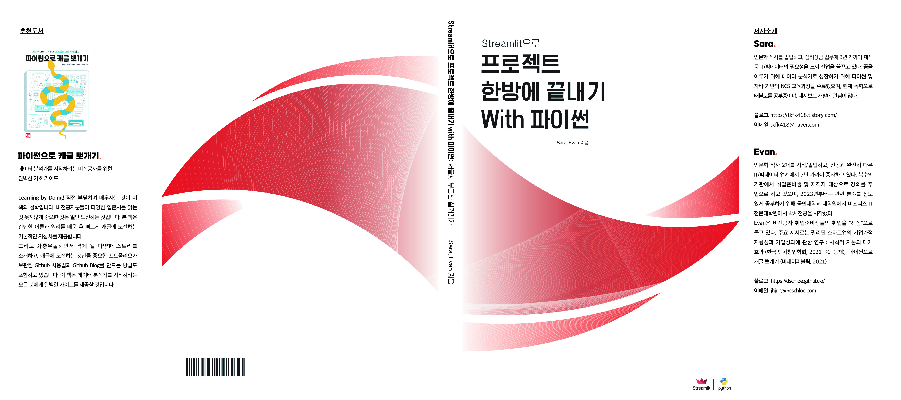

## 교재 구매
- 판매링크
  + 부크크 : https://www.bookk.co.kr/book/view/173250
  + 교보문고 : https://product.kyobobook.co.kr/detail/S000202690179
  + 예스 24 : https://www.yes24.com/Product/Goods/119627688
  + 알라딘 : https://www.aladin.co.kr/shop/wproduct.aspx?ItemId=318939281
  + 북센 : TBD


- 오프라인에서는 판매되지 않습니다. 
- 개정판 출간 협력을 원하시는 출판사가 있으면 `jhjung@dschloe.com`으로 메일 보내주시기를 바랍니다. 

## 사용 설명서
- 소스코드는 출판 당시에는 큰 문제가 없으나, 라이브러리 버전업이 되면 교재와 일치하지 않을 수 있습니다. 
- 교재의 코드 에러 발생이 생기면 본 깃허브 코드를 확인하여 주시기를 바랍니다. 

### 1. 사용환경
- OS : Windows 10 & Windows 11
  + Mac과 Linux에서는 테스트 하지 않았습니다. 
- Python 버전 : Python 3.9.13

### 2. 테스트 준비
- 먼저 Repo를 복사 한 후, 아래와 같이 입력합니다.

```bash
git clone https://github.com/dschloe/streamlitbook-saraevan.git
```

- 폴더 최상위 경로에서 가상환경을 설치합니다. 
```bash
pip install virtualenv # 기존에 이미 설치 한 적 있다면 생략 가능
virtualenv venv
```

- 가상환경에 접속합니다. 
```bash
source venv/Scripts/activate
```

- 라이브러리를 설치합니다.
```bash
pip install -r requirements.txt
```

### 3. 테스트 방법
- 본 교재에는 `.ipynb`, `.py` 두 개의 파일들이 있습니다. 
- `.ipynb` 파일의 경우
  + 먼저 `jupyter lab`에서 실행됩니다. 
```bash
jupyter lab
```

- 일반적인 파이썬 `.py` 파일 실행할 경우
```bash
python a.py
```

- Streamlit 파일 `.py` 파일 실행할 경우
```bash
streamlit run app.py
```

## 데모페이지
- ch08 소스코드는 그대로 실행하지 마시고, 별도로 프로젝트 폴더를 만들어서 사용하기를 바랍니다. 
- 데모 : https://dschloe-streamlit-book-seoul-app-w9me9j.streamlit.app/
  + 무료서버라 동접자가 많을 시, 접속이 안될 수가 있습니다. 

## 코드 에러 문의 
- `권장방법` : 메뉴 `Issues`-`New Issues`-`메모 남기기`-`Submit new issue`
- Sara : tkfk418@naver.com
- Evan : jhjung@dschloe.com

## 향후 업데이트 될 내용
- PDF 교안 (2023년 9월 1일 예정)
- 온라인 강의 (2023년 10월 1일 예정)
- 일정은 변경될 수 있습니다. 

## License
[](https://opensource.org/licenses/MIT)